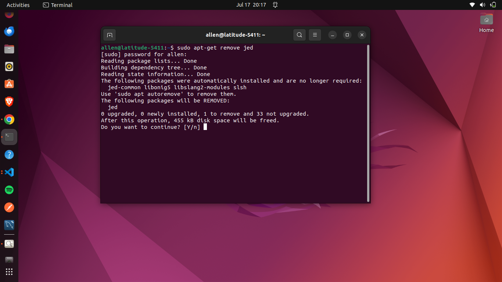
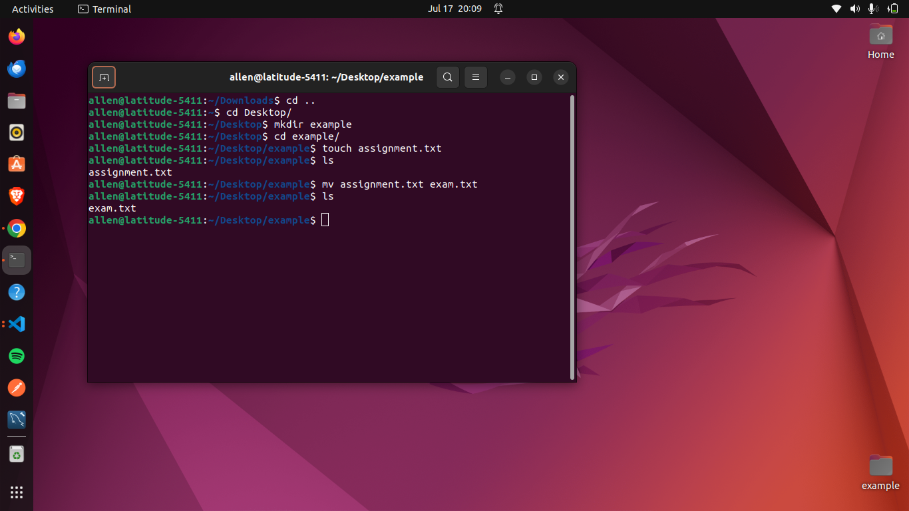
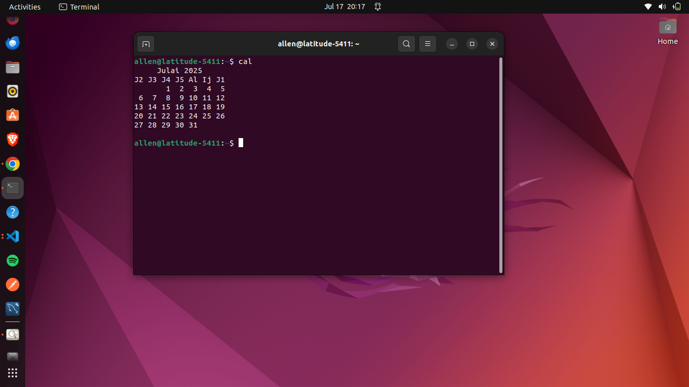
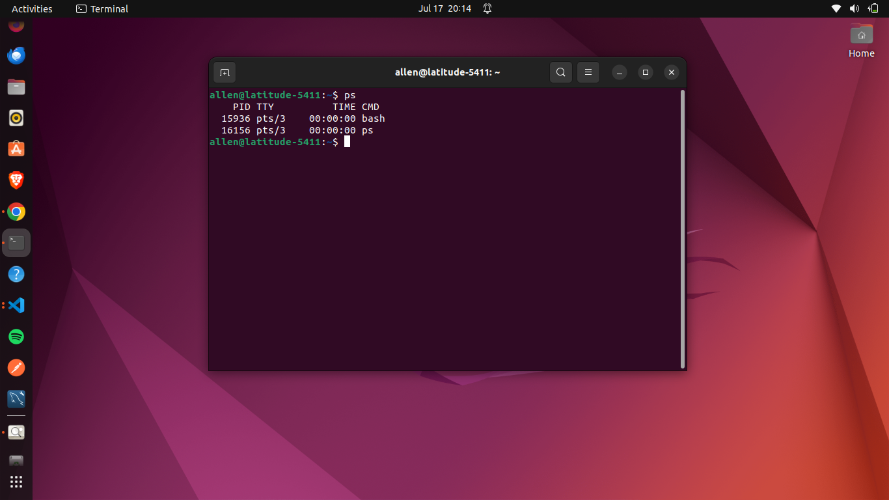
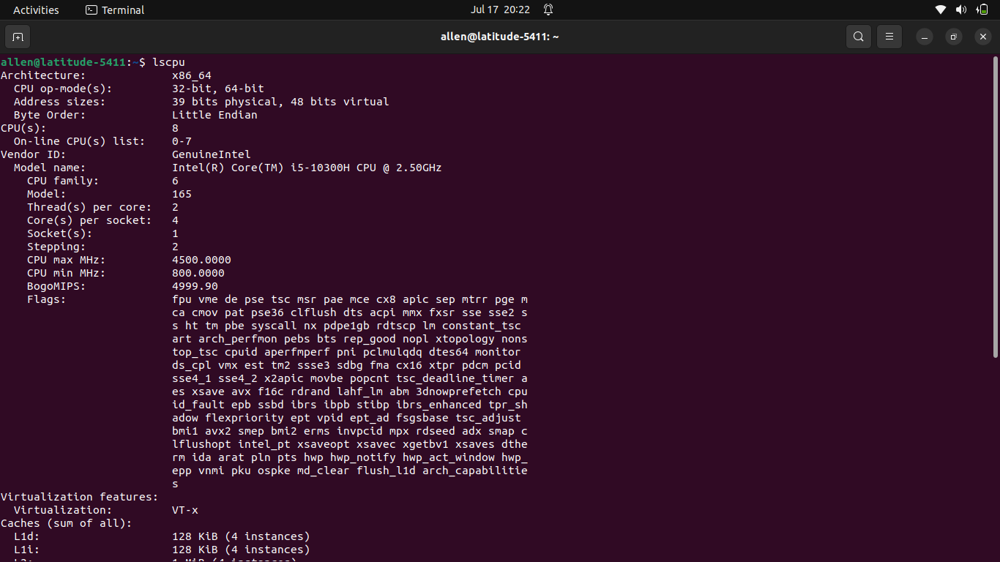
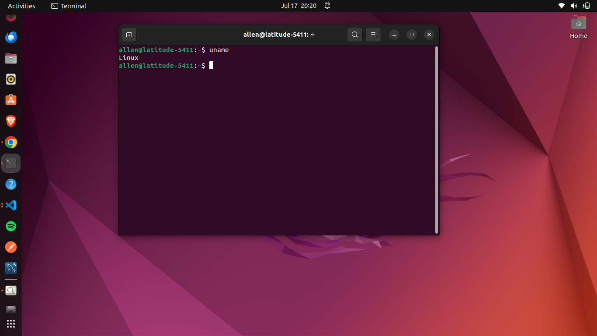
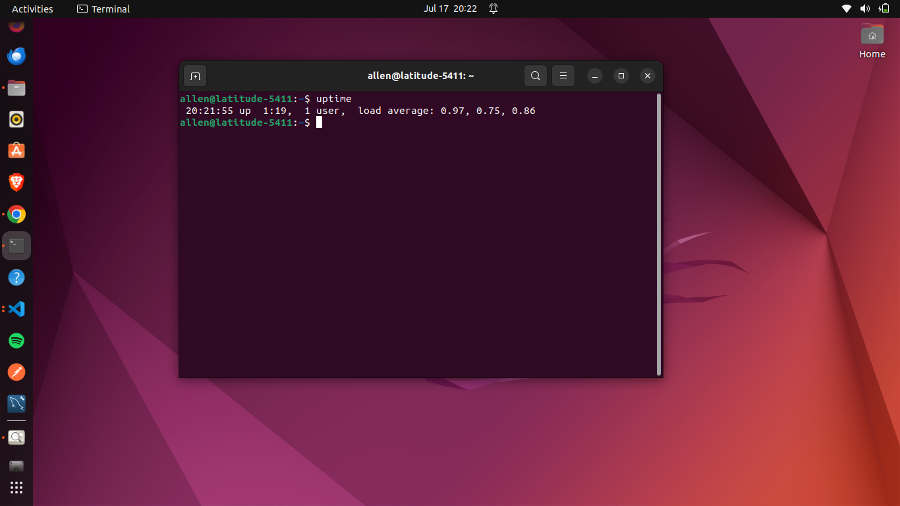

1. apt
  The tool apt, annotation processing tool, includes a set of new reflective APIs and supporting infrastructure to process program annotations.

    `sudo apt-get remove jed`
    

2. free -h 
   The tool free -h, displays memory usage in a human-readable format.

    `free -h` 
    

3. mv - move file
    In its first form, the mv utility renames the file named by the source operand to the destination path named by the target operand.

    `mv assignments.txt exam.txt`
    

4. cal
    The cal utility displays a simple calendar in traditional format and ncal offers an alternative layout, more options and the date of yesterday. 

    `cal`
    

5. ps
    shows all running processes with detailed information

    `ps`
    

6. lscpu
    provides detailed CPU information.

    `lscpu`
    

7. rm 
    The rm utility attempts to remove the non-directory type files specified on the command line.

    `rm -r example`
    

8. df
    The df utility displays statistics about the amount of free disk space on the specified filesystem or on the filesystem of which file is a part.

    `df -h`
    

9. uname
    The uname utility displays all system information.

    `uname -a`
    

10. uptime
    The utility uptime shows the current system uptime.

    `uptime `
    
